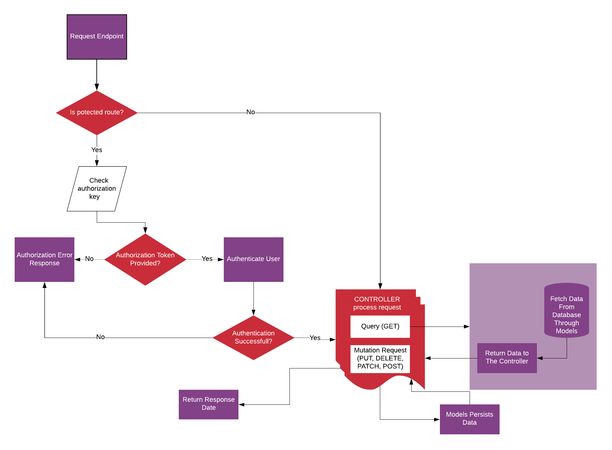

# GeoTours API

> Backend Api for GeoTours application which is a tour directory.You can check out the postman documentation [GeoTours API](https://documenter.getpostman.com/view/5936515/SzKSRyTa)

## PROJECT ARCHITECTURE

The development of this API took into account several specific needs. It is carefully crafted as one that can easily require updates and new features, taking into account the need for scalability, easy maintainance, performance and security. I have chosen to use the MODEL-VIEW CONTROLLER (MVC)
architecture.

### A top-level directory structure

```
C:.
│   .eslintrc.json
│   .gitignore
│   .prettierrc.json
│   app.js
│   package-lock.json
│   package.json
│   README.md
│   seeder.js
│   server.js
│
├───config
│       config.env
│       db.js
│
├───controller
│       auth.js
│       factoryHandler.js
│       globalError.js
│       reviews.js
│       tours.js
│       users.js
│
├───dev-data
│   └───data
│           reviews.json
│           tour5.js
│           tours-simple.json
│           tours.json
│           users.json
│
├───models
│       Reviews.js
│       Tours.js
│       Users.js
│
├───routes
│       reviews.js
│       tours.js
│       users.js
│
└───utils
      ApiFeatures.js
      appError.js
      catchAsync.js
      email.js

```

## API FLOW

The flow of actions across the API can best be described with this diagram.


## Usage

Rename "config/config.env.env" to "config/config.env" and update the values/settings to your own.

## Install Dependencies

```
npm install
```

## Run App

```
# run in development
npm run dev

#run in production
npm start
```

- version: 1.0.0
- licence: MIT
